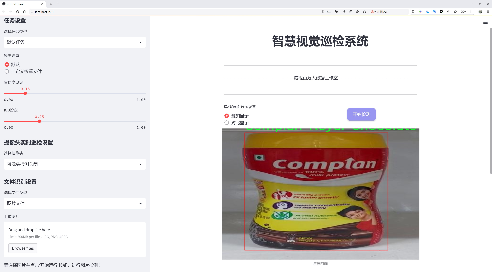
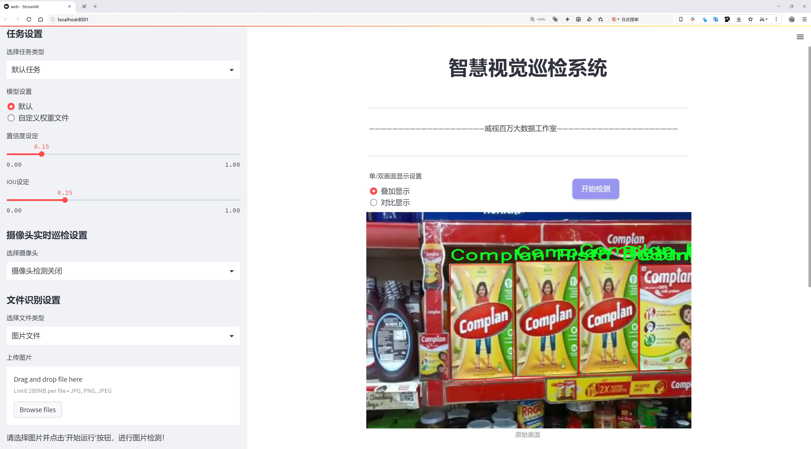
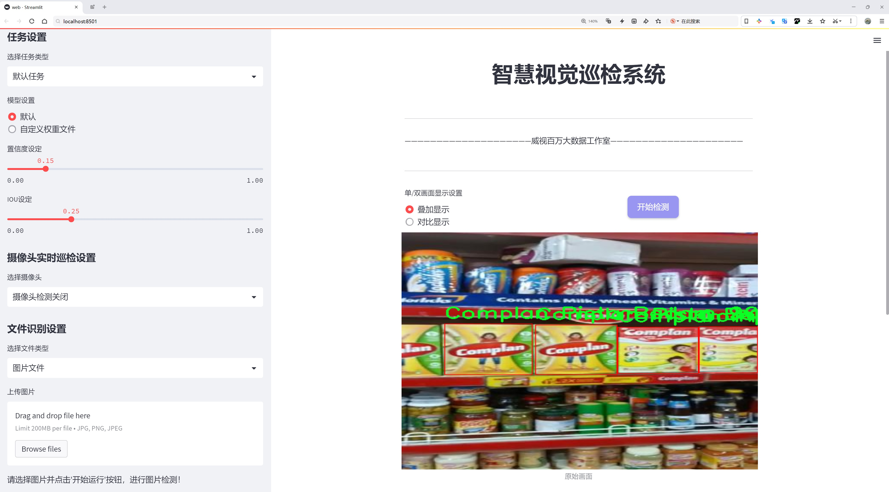
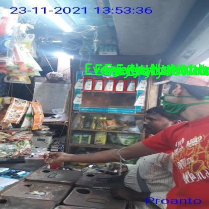
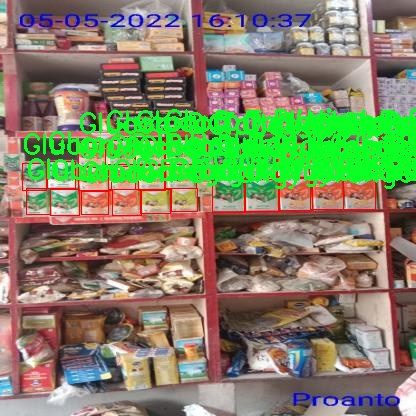
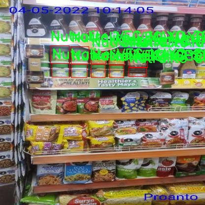
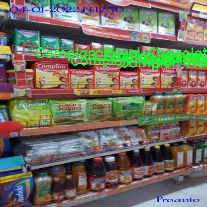
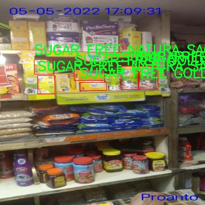

# 货架产品包装检测检测系统源码分享
 # [一条龙教学YOLOV8标注好的数据集一键训练_70+全套改进创新点发刊_Web前端展示]

### 1.研究背景与意义

项目参考[AAAI Association for the Advancement of Artificial Intelligence](https://gitee.com/qunmasj/projects)

项目来源[AACV Association for the Advancement of Computer Vision](https://kdocs.cn/l/cszuIiCKVNis)

研究背景与意义

随着电子商务的迅猛发展和消费者对产品质量的日益关注，货架产品的包装检测变得愈发重要。传统的人工检测方法不仅效率低下，而且容易受到人为因素的影响，导致检测结果的不一致性和不准确性。因此，基于计算机视觉的自动化检测系统应运而生，成为提高产品包装检测效率和准确性的有效手段。在众多计算机视觉技术中，YOLO（You Only Look Once）系列模型因其高效的实时目标检测能力而备受关注。YOLOv8作为该系列的最新版本，具备更强的特征提取能力和更快的推理速度，适合在复杂的货架环境中进行产品包装检测。

本研究旨在基于改进的YOLOv8模型，构建一个高效的货架产品包装检测系统。我们所使用的数据集包含来自Zydus Wellness的8800张图像，涵盖49个不同类别的产品，包括营养补充品、护肤品和调味品等。这些产品的多样性为模型的训练提供了丰富的样本，使其能够更好地适应实际应用中的各种情况。通过对这些图像进行标注和处理，我们能够训练出一个能够准确识别和分类不同产品包装的深度学习模型。

在当前的市场环境中，消费者对产品的包装设计、标签信息和外观质量有着越来越高的期望。一个有效的包装检测系统不仅能够确保产品的合规性，还能提升品牌形象和消费者满意度。此外，自动化的检测系统能够显著降低人工成本，提高生产效率，减少因人为错误导致的损失。因此，基于YOLOv8的货架产品包装检测系统的研究具有重要的理论和实践意义。

本研究的创新之处在于对YOLOv8模型的改进，旨在提高其在复杂环境下的检测精度和速度。通过引入数据增强技术、优化网络结构和调整超参数，我们希望能够提升模型在不同光照、角度和背景下的鲁棒性。此外，结合迁移学习的方法，可以在有限的训练数据上实现更好的性能，从而加速模型的训练过程并提高检测效率。

综上所述，基于改进YOLOv8的货架产品包装检测系统的研究，不仅为解决当前市场上存在的包装检测问题提供了新的思路和方法，也为未来的智能零售和自动化生产提供了技术支持。通过本研究，我们希望能够推动货架产品包装检测技术的发展，提升行业标准，为消费者提供更高质量的产品和服务。

### 2.图片演示







##### 注意：由于此博客编辑较早，上面“2.图片演示”和“3.视频演示”展示的系统图片或者视频可能为老版本，新版本在老版本的基础上升级如下：（实际效果以升级的新版本为准）

  （1）适配了YOLOV8的“目标检测”模型和“实例分割”模型，通过加载相应的权重（.pt）文件即可自适应加载模型。

  （2）支持“图片识别”、“视频识别”、“摄像头实时识别”三种识别模式。

  （3）支持“图片识别”、“视频识别”、“摄像头实时识别”三种识别结果保存导出，解决手动导出（容易卡顿出现爆内存）存在的问题，识别完自动保存结果并导出到tempDir中。

  （4）支持Web前端系统中的标题、背景图等自定义修改，后面提供修改教程。

  另外本项目提供训练的数据集和训练教程,暂不提供权重文件（best.pt）,需要您按照教程进行训练后实现图片演示和Web前端界面演示的效果。

### 3.视频演示

[3.1 视频演示](https://www.bilibili.com/video/BV1eBxKeaEww/)

### 4.数据集信息展示

##### 4.1 本项目数据集详细数据（类别数＆类别名）

nc: 49
names: ['Complan Classic Creme', 'Complan Kesar Badam', 'Complan Nutrigro Badam Kheer', 'Complan Pista Badam', 'Complan Royal Chocolate', 'EY AAAM TULSI TURMERIC FACEWASH50G', 'EY ADVANCED GOLDEN GLOW PEEL OFF M. 50G', 'EY ADVANCED GOLDEN GLOW PEEL OFF M. 90G', 'EY EXF WALNUT SCRUB AYR 200G', 'EY HALDICHANDAN FP HF POWDER 25G', 'EY HYD-EXF WALNT APR SCRUB AYR100G', 'EY HYDR - EXF WALNUT APRICOT SCRUB 50G', 'EY NAT GLOW ORANGE PEEL OFF AY 90G', 'EY NATURALS NEEM FACE WASH AY 50G', 'EY RJ CUCUMBER ALOEVERA FACEPAK50G', 'EY TAN CHOCO CHERRY PACK 50G', 'EY_SCR_PURIFYING_EXFOLTNG_NEEM_PAPAYA_50G', 'Everyuth Naturals Body Lotion Nourishing Cocoa 200ml', 'Everyuth Naturals Body Lotion Rejuvenating Flora 200ml', 'Everyuth Naturals Body Lotion Soothing Citrus 200ml', 'Everyuth Naturals Body Lotion Sun Care Berries SPF 15 200ml', 'Glucon D Nimbu Pani 1.KG', 'Glucon D Regular 1.KG', 'Glucon D Regular 2.KG', 'Glucon D Tangy orange 1.KG', 'Nutralite ACHARI MAYO 300g-275g-25g-', 'Nutralite ACHARI MAYO 30g', 'Nutralite CHEESY GARLIC MAYO 300g-275g-25g-', 'Nutralite CHEESY GARLIC MAYO 30g', 'Nutralite CHOCO SPREAD CALCIUM 275g', 'Nutralite DOODHSHAKTHI PURE GHEE 1L', 'Nutralite TANDOORI MAYO 300g-275g-25g-', 'Nutralite TANDOORI MAYO 30g', 'Nutralite VEG MAYO 300g-275g-25g-', 'Nycil Prickly Heat Powder', 'SUGAR FREE GOLD 500 PELLET', 'SUGAR FREE GOLD POWDER 100GM', 'SUGAR FREE GOLD SACHET 50 SUGAR FREE GOLD SACHET 50', 'SUGAR FREE GOLD SACHET 50', 'SUGAR FREE GRN 300 PELLET', 'SUGAR FREE NATURA 500 PELLET', 'SUGAR FREE NATURA DIET SUGAR 80GM', 'SUGAR FREE NATURA DIET SUGAR', 'SUGAR FREE NATURA SACHET 50', 'SUGAR FREE NATURA SWEET DROPS', 'SUGAR FREE NATURAL DIET SUGAR 80GM', 'SUGAR FREE NATURA_ POWDER_CONC_100G', 'SUGAR FREE_GRN_ POWDER_CONC_100G', 'SUGARLITE POUCH 500G']


##### 4.2 本项目数据集信息介绍

数据集信息展示

在本研究中，我们使用了名为“Zydus Wellness”的数据集，以改进YOLOv8模型在货架产品包装检测系统中的应用。该数据集包含49个类别，涵盖了广泛的产品类型，旨在提高计算机视觉系统在实际零售环境中的识别能力。通过对这一数据集的深入分析和应用，我们希望能够提升产品包装的自动检测精度，从而为零售商和消费者提供更高效的购物体验。

“Zydus Wellness”数据集的类别多样，涉及多个领域的产品，包括营养补充品、护肤品和调味品等。具体而言，数据集中包括了如“Complan Classic Creme”、“Complan Kesar Badam”、“Complan Nutrigro Badam Kheer”等多种营养饮品，这些产品以其丰富的营养成分和多样的口味受到消费者的青睐。此外，数据集中还包含了多款护肤产品，如“EY AAAM TULSI TURMERIC FACEWASH50G”和“EY ADVANCED GOLDEN GLOW PEEL OFF M. 50G”，这些产品的包装设计通常具有较高的视觉吸引力，适合用于测试模型在复杂背景下的识别能力。

调味品类产品在数据集中同样占据了重要地位，例如“Nutralite ACHARI MAYO 300g-275g-25g-”和“Nutralite CHEESY GARLIC MAYO 30g”等。这些产品的包装形态各异，颜色鲜艳，能够为模型提供丰富的训练样本，帮助其学习不同的包装特征和视觉样式。此外，数据集中还包括了糖替代品，如“SUGAR FREE GOLD 500 PELLET”和“SUGAR FREE NATURA DIET SUGAR”，这些产品的包装设计相对简单，但在市场上却有着广泛的应用场景。

通过对“Zydus Wellness”数据集的训练，YOLOv8模型能够在不同的货架环境中准确识别和分类各种产品。这不仅有助于提升货架管理的效率，还能为消费者提供更为便捷的购物体验。例如，在自动补货系统中，模型能够实时监测货架上产品的存量，并及时发出补货请求，从而避免因缺货而导致的销售损失。

此外，数据集的多样性也为模型的泛化能力提供了保障。通过训练，模型不仅能够识别特定品牌的产品，还能够适应不同的包装设计和视觉风格。这一特性在实际应用中尤为重要，因为零售环境中的产品种类繁多，消费者的需求也在不断变化。

总之，“Zydus Wellness”数据集为改进YOLOv8的货架产品包装检测系统提供了丰富的训练素材。通过对该数据集的深入挖掘和应用，我们期望能够实现更高效的产品识别和分类，从而推动零售行业的智能化发展。随着技术的不断进步和数据集的不断扩展，未来的货架管理将更加智能化、自动化，为消费者带来更优质的购物体验。











### 5.全套项目环境部署视频教程（零基础手把手教学）

[5.1 环境部署教程链接（零基础手把手教学）](https://www.ixigua.com/7404473917358506534?logTag=c807d0cbc21c0ef59de5)


[5.2 安装Python虚拟环境创建和依赖库安装视频教程链接（零基础手把手教学）](https://www.ixigua.com/7404474678003106304?logTag=1f1041108cd1f708b01a)

### 6.手把手YOLOV8训练视频教程（零基础小白有手就能学会）

[6.1 手把手YOLOV8训练视频教程（零基础小白有手就能学会）](https://www.ixigua.com/7404477157818401292?logTag=d31a2dfd1983c9668658)

### 7.70+种全套YOLOV8创新点代码加载调参视频教程（一键加载写好的改进模型的配置文件）

[7.1 70+种全套YOLOV8创新点代码加载调参视频教程（一键加载写好的改进模型的配置文件）](https://www.ixigua.com/7404478314661806627?logTag=29066f8288e3f4eea3a4)

### 8.70+种全套YOLOV8创新点原理讲解（非科班也可以轻松写刊发刊，V10版本正在科研待更新）

由于篇幅限制，每个创新点的具体原理讲解就不一一展开，具体见下列网址中的创新点对应子项目的技术原理博客网址【Blog】：


[8.1 70+种全套YOLOV8创新点原理讲解链接](https://gitee.com/qunmasj/good)

### 9.系统功能展示（检测对象为举例，实际内容以本项目数据集为准）

图9.1.系统支持检测结果表格显示

  图9.2.系统支持置信度和IOU阈值手动调节

  图9.3.系统支持自定义加载权重文件best.pt(需要你通过步骤5中训练获得)

  图9.4.系统支持摄像头实时识别

  图9.5.系统支持图片识别

  图9.6.系统支持视频识别

  图9.7.系统支持识别结果文件自动保存

  图9.8.系统支持Excel导出检测结果数据


### 10.原始YOLOV8算法原理

原始YOLOv8算法原理

YOLO（You Only Look Once）系列算法自其诞生以来，便以其高效的目标检测能力和实时性受到广泛关注。YOLOv8作为该系列的最新版本，继承并创新了前几代算法的核心思想，展现出更为卓越的性能。其设计理念不仅关注于检测精度的提升，同时也注重模型的轻量化和计算效率，以适应各种应用场景的需求。

YOLOv8的网络结构由三个主要部分组成：主干网络（Backbone）、特征增强网络（Neck）和检测头（Head）。主干网络负责从输入图像中提取特征，YOLOv8采用了CSP（Cross Stage Partial）网络的思想，旨在通过分离和组合特征来提高特征提取的效率和效果。CSP网络通过将特征图分成两部分，并在不同的路径上进行处理，最终再合并，从而增强了网络的表达能力，减轻了模型的计算负担。

在特征增强网络部分，YOLOv8延续了PAN-FPN（Path Aggregation Network - Feature Pyramid Network）的结构，进一步提升了多尺度特征的融合能力。PAN-FPN通过不同层次的特征图进行上下采样和融合，使得模型能够更好地捕捉到不同尺度目标的特征信息。值得注意的是，YOLOv8在此基础上进行了创新，删除了上采样部分的卷积结构，并引入了C2f模块，这一模块结合了YOLOv5中的C3模块和YOLOv7中的ELAN模块，增加了更多的残差连接。这种设计不仅提升了模型的梯度流动性，还使得网络在轻量化的基础上获得了更丰富的特征信息，从而在目标检测任务中表现出色。

检测头部分是YOLOv8的另一大创新所在。与之前版本的耦合头结构不同，YOLOv8采用了解耦合头结构，将分类和回归任务分离为两个独立的分支。这一设计使得模型在处理复杂场景时，能够更专注于各自的任务，从而有效减少了定位不准和分类错误的问题。此外，YOLOv8还引入了Anchor-Free的目标检测方法，摆脱了传统目标检测中对锚点框的依赖。通过直接回归目标的位置和大小，YOLOv8能够更快速地聚焦于目标的实际位置，极大地提高了检测的准确性和效率。

在训练过程中，YOLOv8还进行了多项优化。数据增强策略上，采用了动态的Task-Aligned Assigner样本分配策略，并在训练的最后10个epoch中关闭了马赛克增强，这些策略旨在提高模型的泛化能力和训练效果。此外，YOLOv8在损失计算方面也进行了创新，使用了BCELoss作为分类损失，而回归损失则结合了DFLLoss和CIoULoss。这种多元化的损失函数设计，使得模型在训练过程中能够更好地平衡分类和回归任务的权重，从而提升整体性能。

YOLOv8的设计不仅仅是对前几代YOLO算法的简单迭代，而是一次全面的创新与优化。其在模型深度、宽度和通道数等方面的灵活设置，使得用户可以根据具体应用场景的需求，选择合适的模型版本。YOLOv8提供了n、s、m、l、x五种不同尺度的模型，用户可以根据实际需求选择最优的模型，以达到性能与效率的最佳平衡。

总的来说，YOLOv8在保持YOLO系列算法高效、实时的特性基础上，通过一系列创新设计，显著提升了目标检测的精度和速度。其轻量化的模型结构和灵活的配置选项，使得YOLOv8能够广泛应用于各类嵌入式设备和实时检测场景中，成为目标检测领域的又一标杆。随着YOLOv8的推广和应用，未来的目标检测技术将更加智能化和高效化，为各行各业的自动化和智能化发展提供强有力的支持。


### 11.项目核心源码讲解（再也不用担心看不懂代码逻辑）

#### 11.1 70+种YOLOv8算法改进源码大全和调试加载训练教程（非必要）\ultralytics\models\fastsam\__init__.py

以下是对提供代码的逐文件分析，保留了最核心的部分，并添加了详细的中文注释：

```python
# Ultralytics YOLO 🚀, AGPL-3.0 license

# 从当前包中导入模型、预测器、提示和验证器类
from .model import FastSAM  # 导入FastSAM模型类
from .predict import FastSAMPredictor  # 导入FastSAMPredictor预测器类
from .prompt import FastSAMPrompt  # 导入FastSAMPrompt提示类
from .val import FastSAMValidator  # 导入FastSAMValidator验证器类

# 定义模块的公开接口，允许用户直接访问这些类
__all__ = 'FastSAMPredictor', 'FastSAM', 'FastSAMPrompt', 'FastSAMValidator'
```

### 代码分析：
1. **导入模块**：
   - 代码中使用了相对导入（`from .`），这意味着这些模块（`model`, `predict`, `prompt`, `val`）都是在同一个包内的子模块。
   - `FastSAM`、`FastSAMPredictor`、`FastSAMPrompt` 和 `FastSAMValidator` 是该包中核心的类，分别负责模型定义、预测、提示生成和验证。

2. **`__all__` 的定义**：
   - `__all__` 是一个特殊变量，用于定义当使用 `from module import *` 时，哪些名称是可以被导入的。这有助于控制模块的公共接口，避免不必要的名称暴露给用户。

### 核心部分：
- 代码的核心在于导入了四个关键类，这些类构成了该包的主要功能模块。通过 `__all__` 定义了它们的可见性，确保用户在使用时能够方便地访问这些功能。

这个文件是一个Python模块的初始化文件，位于Ultralytics YOLO项目的`fastsam`子目录下。它的主要作用是导入和暴露该模块中的几个关键类和功能，以便其他模块或文件可以方便地使用。

首先，文件顶部的注释表明这是Ultralytics YOLO项目的一部分，并且遵循AGPL-3.0许可证。这种许可证通常用于开源软件，允许用户自由使用、修改和分发软件，但要求任何派生作品也必须遵循相同的许可证。

接下来，文件通过`from .model import FastSAM`等语句导入了四个类：`FastSAM`、`FastSAMPredictor`、`FastSAMPrompt`和`FastSAMValidator`。这些类分别可能负责不同的功能，比如模型的定义、预测的执行、提示的处理以及验证的过程。

最后，`__all__`变量定义了该模块的公共接口，列出了可以被外部访问的类名。通过这种方式，使用`from fastsam import *`语句时，只会导入`FastSAMPredictor`、`FastSAM`、`FastSAMPrompt`和`FastSAMValidator`这四个类，而不会导入模块中的其他内容。这有助于控制命名空间，避免潜在的命名冲突。

总的来说，这个初始化文件是Ultralytics YOLO项目中`fastsam`模块的一个重要组成部分，负责组织和暴露该模块的核心功能。

#### 11.2 ui.py

以下是代码中最核心的部分，并附上详细的中文注释：

```python
import sys
import subprocess

def run_script(script_path):
    """
    使用当前 Python 环境运行指定的脚本。

    Args:
        script_path (str): 要运行的脚本路径

    Returns:
        None
    """
    # 获取当前 Python 解释器的路径
    python_path = sys.executable

    # 构建运行命令，使用 streamlit 运行指定的脚本
    command = f'"{python_path}" -m streamlit run "{script_path}"'

    # 执行命令
    result = subprocess.run(command, shell=True)
    # 检查命令执行的返回码，如果不为0，表示执行出错
    if result.returncode != 0:
        print("脚本运行出错。")


# 实例化并运行应用
if __name__ == "__main__":
    # 指定要运行的脚本路径
    script_path = "web.py"  # 这里可以直接指定脚本名称，假设在当前目录下

    # 调用函数运行脚本
    run_script(script_path)
```

### 代码注释说明：
1. **导入模块**：
   - `sys`：用于获取当前 Python 解释器的路径。
   - `subprocess`：用于执行外部命令。

2. **`run_script` 函数**：
   - 该函数接受一个参数 `script_path`，表示要运行的 Python 脚本的路径。
   - 使用 `sys.executable` 获取当前 Python 解释器的路径。
   - 构建一个命令字符串，使用 `streamlit` 模块运行指定的脚本。
   - 使用 `subprocess.run` 执行构建的命令，并通过 `shell=True` 允许在 shell 中执行。
   - 检查命令的返回码，如果返回码不为0，表示脚本运行出错，并打印错误信息。

3. **主程序块**：
   - 通过 `if __name__ == "__main__":` 确保只有在直接运行该脚本时才会执行以下代码。
   - 指定要运行的脚本路径（这里假设脚本名为 `web.py`）。
   - 调用 `run_script` 函数，传入脚本路径以执行该脚本。

这个程序文件的主要功能是使用当前的 Python 环境来运行一个指定的脚本，具体是通过 Streamlit 来启动一个 Web 应用。程序的开头导入了必要的模块，包括 `sys`、`os` 和 `subprocess`，这些模块提供了与系统交互的功能。

在 `run_script` 函数中，首先获取当前 Python 解释器的路径，这样可以确保在正确的环境中运行脚本。接着，构建一个命令字符串，该命令用于调用 Streamlit 来运行指定的脚本。命令的格式是 `python -m streamlit run script_path`，其中 `script_path` 是传入的参数。

使用 `subprocess.run` 方法执行这个命令，`shell=True` 参数表示在 shell 中执行命令。执行后，程序会检查返回的状态码，如果状态码不为零，表示脚本运行过程中出现了错误，此时会打印出“脚本运行出错”的提示。

在文件的最后部分，使用 `if __name__ == "__main__":` 语句来确保只有在直接运行该文件时才会执行后面的代码。在这里，指定了要运行的脚本路径 `web.py`，并调用 `run_script` 函数来启动这个脚本。

总的来说，这个程序提供了一种简单的方式来运行一个 Streamlit 应用，确保在当前 Python 环境中执行，并能够处理运行错误。

#### 11.3 code\ultralytics\trackers\utils\kalman_filter.py

以下是经过简化和注释的核心代码部分，主要包括 `KalmanFilterXYAH` 类及其主要方法。这个类实现了一个简单的卡尔曼滤波器，用于在图像空间中跟踪边界框。

```python
import numpy as np
import scipy.linalg

class KalmanFilterXYAH:
    """
    卡尔曼滤波器类，用于跟踪图像空间中的边界框。
    状态空间为8维 (x, y, a, h, vx, vy, va, vh)，
    包含边界框中心位置 (x, y)，宽高比 a，高度 h 及其各自的速度。
    """

    def __init__(self):
        """初始化卡尔曼滤波器的模型矩阵和不确定性权重。"""
        ndim, dt = 4, 1.0  # 状态维度和时间步长

        # 创建卡尔曼滤波器的运动矩阵
        self._motion_mat = np.eye(2 * ndim, 2 * ndim)  # 2倍状态维度的单位矩阵
        for i in range(ndim):
            self._motion_mat[i, ndim + i] = dt  # 设置速度部分
        self._update_mat = np.eye(ndim, 2 * ndim)  # 更新矩阵

        # 运动和观测的不确定性权重
        self._std_weight_position = 1.0 / 20  # 位置不确定性
        self._std_weight_velocity = 1.0 / 160  # 速度不确定性

    def initiate(self, measurement: np.ndarray) -> tuple:
        """
        从未关联的测量值创建跟踪。

        Args:
            measurement (ndarray): 边界框坐标 (x, y, a, h)。

        Returns:
            (tuple[ndarray, ndarray]): 返回新的跟踪的均值向量和协方差矩阵。
        """
        mean_pos = measurement  # 位置均值
        mean_vel = np.zeros_like(mean_pos)  # 速度均值初始化为0
        mean = np.r_[mean_pos, mean_vel]  # 合并位置和速度均值

        # 初始化协方差矩阵的标准差
        std = [
            2 * self._std_weight_position * measurement[3],  # 高度的标准差
            2 * self._std_weight_position * measurement[3],  # 高度的标准差
            1e-2,  # 宽高比的标准差
            2 * self._std_weight_position * measurement[3],  # 高度的标准差
            10 * self._std_weight_velocity * measurement[3],  # 速度的标准差
            10 * self._std_weight_velocity * measurement[3],  # 速度的标准差
            1e-5,  # 角速度的标准差
            10 * self._std_weight_velocity * measurement[3],  # 速度的标准差
        ]
        covariance = np.diag(np.square(std))  # 协方差矩阵
        return mean, covariance

    def predict(self, mean: np.ndarray, covariance: np.ndarray) -> tuple:
        """
        执行卡尔曼滤波器的预测步骤。

        Args:
            mean (ndarray): 上一时间步的状态均值向量。
            covariance (ndarray): 上一时间步的状态协方差矩阵。

        Returns:
            (tuple[ndarray, ndarray]): 返回预测状态的均值向量和协方差矩阵。
        """
        # 计算运动过程中的不确定性
        std_pos = [
            self._std_weight_position * mean[3],
            self._std_weight_position * mean[3],
            1e-2,
            self._std_weight_position * mean[3],
        ]
        std_vel = [
            self._std_weight_velocity * mean[3],
            self._std_weight_velocity * mean[3],
            1e-5,
            self._std_weight_velocity * mean[3],
        ]
        motion_cov = np.diag(np.square(np.r_[std_pos, std_vel]))  # 运动协方差

        # 预测均值和协方差
        mean = np.dot(mean, self._motion_mat.T)  # 更新均值
        covariance = np.linalg.multi_dot((self._motion_mat, covariance, self._motion_mat.T)) + motion_cov  # 更新协方差

        return mean, covariance

    def update(self, mean: np.ndarray, covariance: np.ndarray, measurement: np.ndarray) -> tuple:
        """
        执行卡尔曼滤波器的校正步骤。

        Args:
            mean (ndarray): 预测状态的均值向量。
            covariance (ndarray): 状态的协方差矩阵。
            measurement (ndarray): 测量向量 (x, y, a, h)。

        Returns:
            (tuple[ndarray, ndarray]): 返回经过测量校正后的状态分布。
        """
        projected_mean, projected_cov = self.project(mean, covariance)  # 投影到测量空间

        # 计算卡尔曼增益
        chol_factor, lower = scipy.linalg.cho_factor(projected_cov, lower=True, check_finite=False)
        kalman_gain = scipy.linalg.cho_solve(
            (chol_factor, lower), np.dot(covariance, self._update_mat.T).T, check_finite=False
        ).T
        innovation = measurement - projected_mean  # 计算创新

        # 更新均值和协方差
        new_mean = mean + np.dot(innovation, kalman_gain.T)
        new_covariance = covariance - np.linalg.multi_dot((kalman_gain, projected_cov, kalman_gain.T))
        return new_mean, new_covariance

    def project(self, mean: np.ndarray, covariance: np.ndarray) -> tuple:
        """
        将状态分布投影到测量空间。

        Args:
            mean (ndarray): 状态的均值向量。
            covariance (ndarray): 状态的协方差矩阵。

        Returns:
            (tuple[ndarray, ndarray]): 返回投影后的均值和协方差矩阵。
        """
        std = [
            self._std_weight_position * mean[3],
            self._std_weight_position * mean[3],
            1e-1,
            self._std_weight_position * mean[3],
        ]
        innovation_cov = np.diag(np.square(std))  # 创新协方差

        mean = np.dot(self._update_mat, mean)  # 更新均值
        covariance = np.linalg.multi_dot((self._update_mat, covariance, self._update_mat.T))  # 更新协方差
        return mean, covariance + innovation_cov  # 返回投影后的均值和协方差
```

### 代码说明：
1. **类定义**：`KalmanFilterXYAH` 是一个卡尔曼滤波器的实现，用于跟踪边界框的状态。
2. **初始化**：在 `__init__` 方法中，初始化了运动矩阵和不确定性权重。
3. **初始化跟踪**：`initiate` 方法根据测量值创建新的跟踪状态，返回均值和协方差。
4. **预测步骤**：`predict` 方法根据当前状态的均值和协方差进行预测，返回更新后的均值和协方差。
5. **更新步骤**：`update` 方法根据新的测量值更新状态，返回校正后的均值和协方差。
6. **投影步骤**：`project` 方法将状态分布投影到测量空间，返回投影后的均值和协方差。

以上是卡尔曼滤波器的核心实现，适用于跟踪任务。

这个程序文件实现了一个简单的卡尔曼滤波器，用于在图像空间中跟踪边界框。文件中定义了两个类：`KalmanFilterXYAH`和`KalmanFilterXYWH`，分别用于处理不同形式的边界框表示。

`KalmanFilterXYAH`类使用8维状态空间，包括边界框的中心位置（x, y）、宽高比（a）、高度（h）及其各自的速度（vx, vy, va, vh）。该类的初始化方法设置了运动模型和观测模型的矩阵，并定义了位置和速度的不确定性权重。`initiate`方法根据给定的测量值（边界框的坐标）创建一个新的跟踪对象，并返回其均值向量和协方差矩阵。

`predict`方法执行卡尔曼滤波的预测步骤，更新状态的均值和协方差。`project`方法将状态分布投影到测量空间，以便进行更新。`update`方法执行卡尔曼滤波的校正步骤，结合预测的状态和新的测量值来更新状态分布。

`gating_distance`方法计算状态分布与测量值之间的门控距离，帮助判断测量值是否与当前状态相关。该方法支持两种距离度量方式：高斯距离和马哈距离。

`KalmanFilterXYWH`类继承自`KalmanFilterXYAH`，主要用于处理边界框的宽度（w）和高度（h），其余功能与父类相似。`initiate`、`predict`、`project`和`update`方法在此类中被重写，以适应新的状态表示。

总体而言，这个文件实现了一个灵活的卡尔曼滤波器，可以用于不同形式的边界框跟踪，适用于多种计算机视觉任务。

#### 11.4 train.py

以下是经过简化并注释的核心代码部分：

```python
import random
import numpy as np
import torch.nn as nn
from ultralytics.data import build_dataloader, build_yolo_dataset
from ultralytics.engine.trainer import BaseTrainer
from ultralytics.models import yolo
from ultralytics.nn.tasks import DetectionModel
from ultralytics.utils import LOGGER, RANK
from ultralytics.utils.torch_utils import de_parallel, torch_distributed_zero_first

class DetectionTrainer(BaseTrainer):
    """
    基于检测模型的训练类，继承自BaseTrainer类。
    """

    def build_dataset(self, img_path, mode="train", batch=None):
        """
        构建YOLO数据集。

        参数:
            img_path (str): 包含图像的文件夹路径。
            mode (str): 模式，`train`表示训练模式，`val`表示验证模式。
            batch (int, optional): 批次大小，仅用于`rect`模式。默认为None。
        """
        gs = max(int(de_parallel(self.model).stride.max() if self.model else 0), 32)  # 获取模型的最大步幅
        return build_yolo_dataset(self.args, img_path, batch, self.data, mode=mode, rect=mode == "val", stride=gs)

    def get_dataloader(self, dataset_path, batch_size=16, rank=0, mode="train"):
        """构建并返回数据加载器。"""
        assert mode in ["train", "val"]  # 确保模式有效
        with torch_distributed_zero_first(rank):  # 仅在DDP中初始化数据集
            dataset = self.build_dataset(dataset_path, mode, batch_size)  # 构建数据集
        shuffle = mode == "train"  # 训练模式下打乱数据
        workers = self.args.workers if mode == "train" else self.args.workers * 2  # 设置工作线程数
        return build_dataloader(dataset, batch_size, workers, shuffle, rank)  # 返回数据加载器

    def preprocess_batch(self, batch):
        """对图像批次进行预处理，包括缩放和转换为浮点数。"""
        batch["img"] = batch["img"].to(self.device, non_blocking=True).float() / 255  # 将图像转换为浮点数并归一化
        if self.args.multi_scale:  # 如果启用多尺度
            imgs = batch["img"]
            sz = (
                random.randrange(self.args.imgsz * 0.5, self.args.imgsz * 1.5 + self.stride)
                // self.stride
                * self.stride
            )  # 随机选择新的尺寸
            sf = sz / max(imgs.shape[2:])  # 计算缩放因子
            if sf != 1:
                ns = [
                    math.ceil(x * sf / self.stride) * self.stride for x in imgs.shape[2:]
                ]  # 计算新的形状
                imgs = nn.functional.interpolate(imgs, size=ns, mode="bilinear", align_corners=False)  # 调整图像大小
            batch["img"] = imgs  # 更新批次图像
        return batch

    def get_model(self, cfg=None, weights=None, verbose=True):
        """返回YOLO检测模型。"""
        model = DetectionModel(cfg, nc=self.data["nc"], verbose=verbose and RANK == -1)  # 创建检测模型
        if weights:
            model.load(weights)  # 加载权重
        return model

    def plot_training_samples(self, batch, ni):
        """绘制带有注释的训练样本。"""
        plot_images(
            images=batch["img"],
            batch_idx=batch["batch_idx"],
            cls=batch["cls"].squeeze(-1),
            bboxes=batch["bboxes"],
            paths=batch["im_file"],
            fname=self.save_dir / f"train_batch{ni}.jpg",
            on_plot=self.on_plot,
        )

    def plot_metrics(self):
        """从CSV文件中绘制指标。"""
        plot_results(file=self.csv, on_plot=self.on_plot)  # 保存结果图
```

### 代码说明：
1. **类定义**：`DetectionTrainer`类用于训练YOLO检测模型，继承自`BaseTrainer`。
2. **数据集构建**：`build_dataset`方法根据给定的图像路径和模式构建YOLO数据集。
3. **数据加载器**：`get_dataloader`方法构建并返回数据加载器，支持训练和验证模式。
4. **批次预处理**：`preprocess_batch`方法对输入的图像批次进行预处理，包括归一化和可选的多尺度调整。
5. **模型获取**：`get_model`方法返回一个YOLO检测模型，并可选择加载预训练权重。
6. **绘图功能**：`plot_training_samples`和`plot_metrics`方法用于可视化训练样本和训练指标。

这个程序文件 `train.py` 是一个用于训练目标检测模型的脚本，基于Ultralytics YOLO（You Only Look Once）框架。程序首先导入了必要的库和模块，包括数学运算、随机数生成、深度学习相关的PyTorch库，以及Ultralytics框架中的一些工具和功能。

文件中定义了一个名为 `DetectionTrainer` 的类，该类继承自 `BaseTrainer`，专门用于基于检测模型的训练。类的文档字符串中提供了一个简单的示例，展示了如何使用该类进行训练。

在 `DetectionTrainer` 类中，定义了多个方法来实现训练过程中的不同功能。`build_dataset` 方法用于构建YOLO数据集，接受图像路径、模式（训练或验证）和批量大小作为参数。它通过调用 `build_yolo_dataset` 函数来生成数据集，支持不同的增强策略。

`get_dataloader` 方法则负责构建并返回数据加载器，确保在分布式训练时只初始化一次数据集。该方法根据模式选择是否打乱数据，并根据训练或验证模式设置工作线程的数量。

`preprocess_batch` 方法用于对图像批次进行预处理，包括缩放和转换为浮点数。该方法支持多尺度训练，随机选择图像的大小并进行插值处理，以适应模型的输入要求。

`set_model_attributes` 方法用于设置模型的属性，包括类别数量和类别名称，以确保模型与数据集的一致性。

`get_model` 方法返回一个YOLO检测模型实例，并可以加载预训练权重。`get_validator` 方法则返回一个用于模型验证的 `DetectionValidator` 实例。

`label_loss_items` 方法用于返回带有标签的训练损失项字典，方便监控训练过程中的损失变化。`progress_string` 方法返回一个格式化的字符串，显示训练进度，包括当前的轮次、GPU内存使用情况、损失值、实例数量和图像大小。

`plot_training_samples` 方法用于绘制训练样本及其标注，便于可视化训练数据。最后，`plot_metrics` 和 `plot_training_labels` 方法用于绘制训练过程中的指标和标签，帮助分析模型的训练效果。

整体来看，这个文件提供了一个完整的训练框架，涵盖了数据加载、预处理、模型构建、训练监控和结果可视化等多个方面，适用于目标检测任务的训练过程。

#### 11.5 code\ultralytics\models\yolo\obb\val.py

以下是经过简化和注释的核心代码部分：

```python
# 导入必要的库
from pathlib import Path
import torch
from ultralytics.models.yolo.detect import DetectionValidator
from ultralytics.utils import ops
from ultralytics.utils.metrics import batch_probiou
from ultralytics.utils.plotting import output_to_rotated_target, plot_images

class OBBValidator(DetectionValidator):
    """
    OBBValidator类用于基于定向边界框（OBB）模型的验证。
    """

    def __init__(self, dataloader=None, save_dir=None, pbar=None, args=None, _callbacks=None):
        """初始化OBBValidator并将任务设置为'obb'，指标设置为OBBMetrics。"""
        super().__init__(dataloader, save_dir, pbar, args, _callbacks)
        self.args.task = "obb"  # 设置任务类型为OBB
        self.metrics = OBBMetrics(save_dir=self.save_dir, plot=True, on_plot=self.on_plot)  # 初始化指标

    def postprocess(self, preds):
        """对预测输出应用非极大值抑制（NMS）。"""
        return ops.non_max_suppression(
            preds,
            self.args.conf,  # 置信度阈值
            self.args.iou,   # IOU阈值
            labels=self.lb,
            nc=self.nc,
            multi_label=True,
            agnostic=self.args.single_cls,
            max_det=self.args.max_det,
            rotated=True,    # 处理旋转框
        )

    def _process_batch(self, detections, gt_bboxes, gt_cls):
        """
        返回正确的预测矩阵。

        参数:
            detections (torch.Tensor): 形状为[N, 6]的检测张量，格式为[x1, y1, x2, y2, conf, class]。
            gt_bboxes (torch.Tensor): 真实边界框张量。
            gt_cls (torch.Tensor): 真实类别张量。

        返回:
            (torch.Tensor): 形状为[N, 10]的正确预测矩阵，表示10个IOU级别。
        """
        iou = batch_probiou(gt_bboxes, torch.cat([detections[:, :4], detections[:, -1:]], dim=-1))  # 计算IOU
        return self.match_predictions(detections[:, 5], gt_cls, iou)  # 匹配预测与真实标签

    def plot_predictions(self, batch, preds, ni):
        """在输入图像上绘制预测的边界框并保存结果。"""
        plot_images(
            batch["img"],  # 输入图像
            *output_to_rotated_target(preds, max_det=self.args.max_det),  # 处理后的预测结果
            paths=batch["im_file"],  # 图像文件路径
            fname=self.save_dir / f"val_batch{ni}_pred.jpg",  # 保存文件名
            names=self.names,  # 类别名称
            on_plot=self.on_plot,
        )

    def eval_json(self, stats):
        """评估YOLO输出的JSON格式并返回性能统计信息。"""
        if self.args.save_json and len(self.jdict):
            import json
            from collections import defaultdict

            pred_json = self.save_dir / "predictions.json"  # 预测结果的JSON文件
            pred_txt = self.save_dir / "predictions_txt"  # 预测结果的TXT文件
            pred_txt.mkdir(parents=True, exist_ok=True)  # 创建目录
            data = json.load(open(pred_json))  # 加载JSON数据

            # 保存结果
            for d in data:
                image_id = d["image_id"]
                score = d["score"]
                classname = self.names[d["category_id"]].replace(" ", "-")
                p = d["poly"]

                with open(f'{pred_txt / f"Task1_{classname}"}.txt', "a") as f:
                    f.writelines(f"{image_id} {score} {p[0]} {p[1]} {p[2]} {p[3]} {p[4]} {p[5]} {p[6]} {p[7]}\n")

        return stats  # 返回统计信息
```

### 代码注释说明：
1. **导入部分**：导入了必要的库和模块，包括路径处理、PyTorch、YOLO检测器、操作和绘图工具。
2. **类定义**：`OBBValidator`类继承自`DetectionValidator`，用于实现基于定向边界框的验证。
3. **初始化方法**：在初始化时设置任务类型和指标。
4. **后处理方法**：对预测结果应用非极大值抑制，过滤掉低置信度的检测。
5. **批处理方法**：处理检测结果与真实标签，计算IOU并匹配预测。
6. **绘图方法**：将预测的边界框绘制在输入图像上并保存。
7. **评估方法**：将预测结果保存为JSON格式，并根据需要输出到TXT文件。

这个程序文件是一个用于基于定向边界框（OBB）模型进行验证的类，名为 `OBBValidator`，它继承自 `DetectionValidator` 类。该类主要用于在YOLO（You Only Look Once）模型的上下文中进行目标检测的验证。

在类的初始化方法中，设置了任务类型为“obb”，并初始化了用于评估的指标 `OBBMetrics`，同时设置了一些其他参数。接下来的 `init_metrics` 方法用于初始化评估指标，检查数据集是否为DOTA格式。

`postprocess` 方法实现了对预测输出的非极大值抑制（NMS），以减少重叠的检测框。`_process_batch` 方法则用于处理每个批次的检测结果和真实标签，计算交并比（IoU）并返回正确的预测矩阵。

`_prepare_batch` 和 `_prepare_pred` 方法分别用于准备输入批次和预测结果，确保边界框的坐标经过适当的缩放和填充，以便于后续的验证过程。`plot_predictions` 方法则用于将预测的边界框绘制在输入图像上并保存结果。

在 `pred_to_json` 方法中，预测结果被序列化为COCO格式的JSON文件，以便于后续的分析和评估。`save_one_txt` 方法将YOLO检测结果保存为特定格式的文本文件，包含归一化的坐标。

最后，`eval_json` 方法用于评估YOLO输出的JSON格式，生成性能统计信息，并将结果保存为DOTA格式的文本文件。该方法会根据需要将预测结果分割并合并，以确保输出的准确性和一致性。

整体而言，这个文件实现了一个完整的验证流程，涵盖了从数据准备、预测处理到结果保存和评估的各个环节，适用于使用YOLO模型进行目标检测的任务。

#### 11.6 70+种YOLOv8算法改进源码大全和调试加载训练教程（非必要）\ultralytics\nn\extra_modules\__init__.py

以下是保留的核心部分，并附上详细的中文注释：

```python
# 导入模块
# 从当前包中导入各个模块，这些模块可能包含构建神经网络所需的不同组件。

from .afpn import *  # 导入自适应特征金字塔网络（AFPN）相关的功能和类
from .attention import *  # 导入注意力机制相关的功能和类
from .block import *  # 导入网络中的基本构建块，例如卷积块、激活块等
from .head import *  # 导入网络的头部模块，通常用于最终的分类或回归任务
from .rep_block import *  # 导入重复块，可能用于构建深层网络
from .kernel_warehouse import *  # 导入内核仓库，可能用于存储和管理卷积核
from .dynamic_snake_conv import *  # 导入动态蛇形卷积，可能用于改进卷积操作
from .orepa import *  # 导入OREPA模块，可能用于优化网络的某些方面
from .RFAConv import *  # 导入RFA卷积，可能是某种特定的卷积操作
```

### 注释说明：
1. **模块导入**：这些导入语句从当前包中引入不同的模块，通常用于构建深度学习模型。每个模块可能包含特定的功能、类或方法，帮助实现特定的网络结构或算法。
2. **星号（*）导入**：使用星号导入意味着将模块中的所有公共成员导入到当前命名空间中。这在某些情况下可能导致命名冲突，因此在大型项目中应谨慎使用。
3. **功能模块**：每个导入的模块名称暗示了其功能，例如：
   - `afpn` 可能涉及特征金字塔网络的实现，用于处理多尺度特征。
   - `attention` 模块可能实现了注意力机制，增强模型对重要特征的关注。
   - `block` 和 `rep_block` 可能是构建深度学习模型的基础组件。
   - `head` 通常指向模型的输出层，负责最终的预测任务。
   - 其他模块如 `dynamic_snake_conv` 和 `RFAConv` 可能涉及特定的卷积操作，优化网络性能。

通过这些模块的组合，可以构建出复杂的深度学习模型，以处理各种计算机视觉或其他任务。

这个程序文件是一个Python模块的初始化文件，通常用于包的结构化管理。在这个文件中，通过导入其他模块的方式，将多个功能模块整合到一起，方便后续使用。

具体来看，这个文件导入了多个模块，包括`afpn`、`attention`、`block`、`head`、`rep_block`、`kernel_warehouse`、`dynamic_snake_conv`、`orepa`和`RFAConv`。这些模块可能包含了与YOLOv8算法相关的不同功能或组件。

- `afpn`：可能是与特征金字塔网络（FPN）相关的模块，用于多尺度特征的提取。
- `attention`：通常与注意力机制相关，可能用于增强模型对重要特征的关注。
- `block`：可能定义了基本的网络块，用于构建更复杂的网络结构。
- `head`：通常指网络的输出部分，可能包含分类和回归的功能。
- `rep_block`：可能是指重复使用的网络块，常用于构建深层网络。
- `kernel_warehouse`：可能涉及卷积核的管理或生成。
- `dynamic_snake_conv`：可能是一个动态卷积模块，提供更灵活的卷积操作。
- `orepa`：可能是某种特定的增强模块，具体功能需要查看该模块的实现。
- `RFAConv`：可能是与某种特定卷积操作相关的模块。

通过这种方式，用户在使用这个包时，可以直接访问这些模块的功能，而不需要单独导入每一个模块。这种结构化的设计提高了代码的可读性和可维护性，同时也方便了模块的管理和使用。

### 12.系统整体结构（节选）

### 整体功能和构架概括

该项目是一个基于YOLOv8算法的目标检测框架，包含了多种算法改进和模块化设计。整体结构包括模型训练、验证、跟踪、卡尔曼滤波、用户界面以及各种辅助模块。项目旨在提供一个灵活的环境，以便用户可以方便地进行目标检测模型的训练、验证和应用。

主要功能模块包括：

1. **模型定义与训练**：提供了YOLOv8及其变种的模型定义和训练逻辑。
2. **验证与评估**：实现了对模型输出的验证和评估，支持多种输出格式。
3. **跟踪与滤波**：集成了卡尔曼滤波器，用于目标跟踪。
4. **用户界面**：提供了简单的用户界面以便于启动和管理训练过程。
5. **额外模块**：包含了多种额外的网络模块和工具，增强了模型的灵活性和性能。

### 文件功能整理表

| 文件路径                                                                                              | 功能描述                                                                                          |
|-----------------------------------------------------------------------------------------------------|--------------------------------------------------------------------------------------------------|
| `ultralytics/models/fastsam/__init__.py`                                                           | 初始化`fastsam`模块，导入核心类和功能。                                                          |
| `ui.py`                                                                                             | 提供一个简单的用户界面，用于运行Streamlit应用。                                                  |
| `code/ultralytics/trackers/utils/kalman_filter.py`                                                | 实现卡尔曼滤波器，用于目标跟踪，支持不同形式的边界框表示。                                       |
| `train.py`                                                                                          | 定义`DetectionTrainer`类，负责目标检测模型的训练过程，包括数据加载、预处理和训练监控。          |
| `code/ultralytics/models/yolo/obb/val.py`                                                          | 实现`OBBValidator`类，用于基于定向边界框的模型验证，处理预测结果和评估指标。                    |
| `ultralytics/nn/extra_modules/__init__.py`                                                        | 初始化`extra_modules`包，导入多个网络模块以增强YOLOv8模型的功能。                              |
| `ultralytics/nn/extra_modules/afpn.py`                                                             | 实现特征金字塔网络（FPN）相关功能，用于多尺度特征提取。                                          |
| `ultralytics/nn/__init__.py`                                                                       | 初始化`nn`模块，整合神经网络相关的功能和模块。                                                  |
| `ultralytics/models/sam/modules/decoders.py`                                                      | 实现解码器模块，可能用于处理模型输出的后处理。                                                  |
| `code/ultralytics/models/rtdetr/train.py`                                                          | 定义RTDETR模型的训练逻辑，具体实现待分析。                                                      |
| `code/ultralytics/models/fastsam/utils.py`                                                         | 提供`fastsam`模块的辅助功能和工具函数。                                                          |
| `ultralytics/utils/callbacks/tensorboard.py`                                                      | 实现与TensorBoard的集成，支持训练过程中的可视化和监控。                                          |

这个表格总结了每个文件的主要功能，便于快速了解项目的结构和各个模块的作用。

注意：由于此博客编辑较早，上面“11.项目核心源码讲解（再也不用担心看不懂代码逻辑）”中部分代码可能会优化升级，仅供参考学习，完整“训练源码”、“Web前端界面”和“70+种创新点源码”以“13.完整训练+Web前端界面+70+种创新点源码、数据集获取”的内容为准。

### 13.完整训练+Web前端界面+70+种创新点源码、数据集获取


# [下载链接：https://mbd.pub/o/bread/Zpublpdq](https://mbd.pub/o/bread/Zpublpdq)